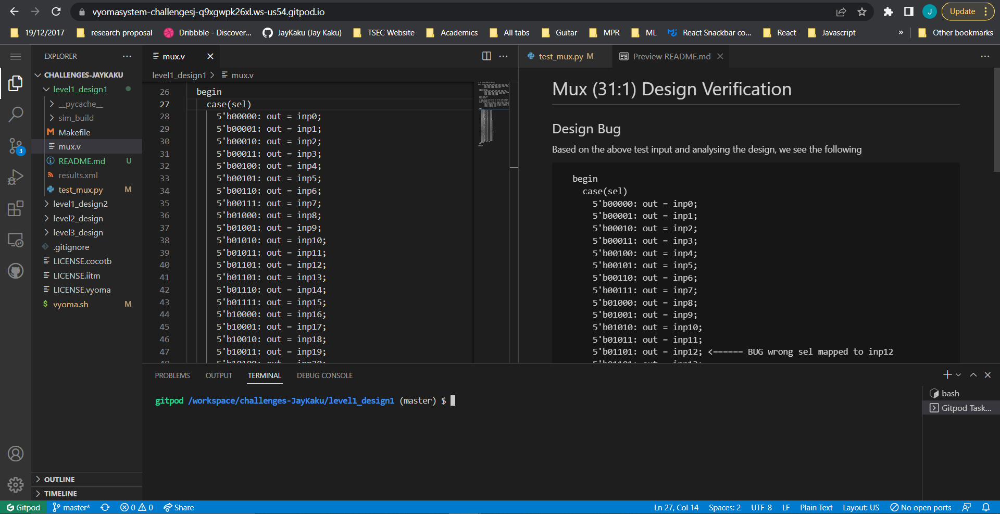
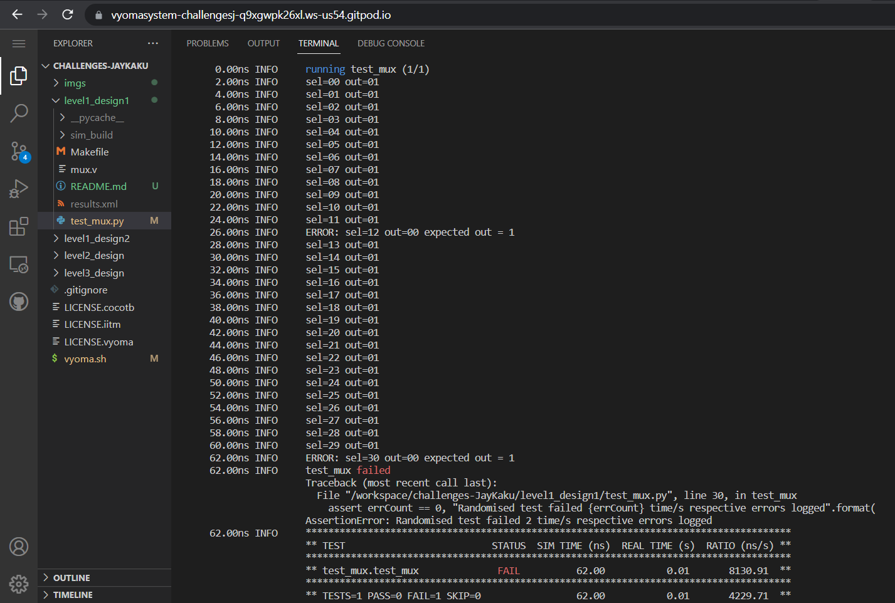
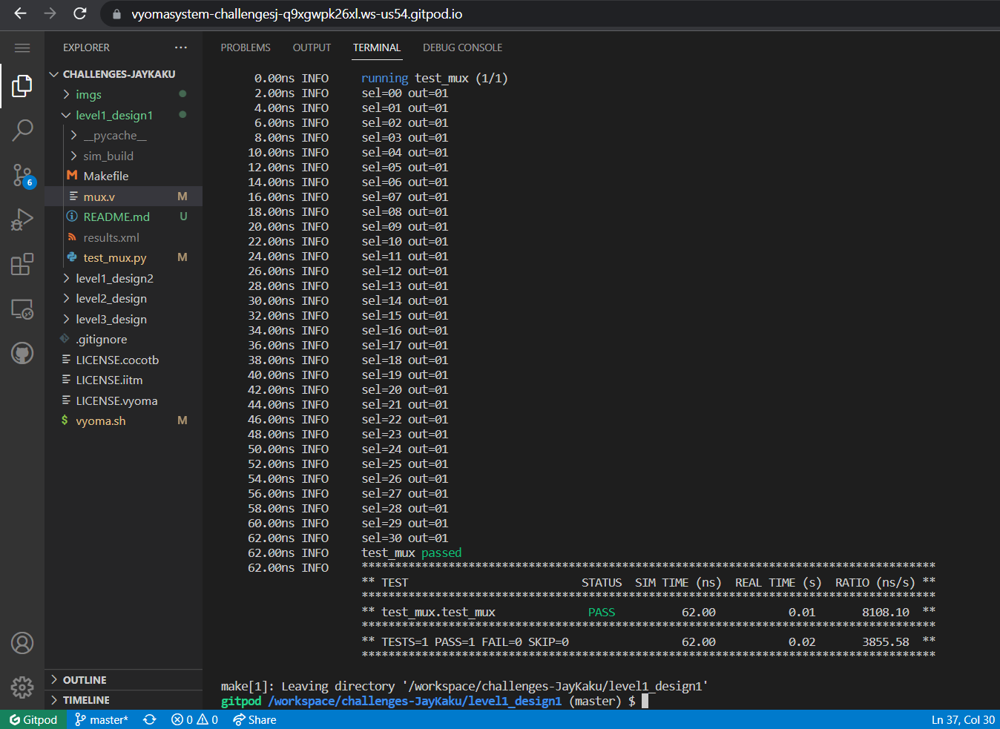

# Mux (31:1) Design Verification

The verification environment is setup using [Vyoma's UpTickPro](https://vyomasystems.com) provided for the hackathon.



## Verification Environment

The [CoCoTb](https://www.cocotb.org/) based Python test is developed as explained. 

Values form 0 to 31 (inclusive) are applied on the `sel` while the respective `inp` = 1 i.e. set to active and the others are by default set to 0
 
 Code:
 ```
for i in range(0,31): 
  dut.inp{1}.value = 1
  dut.sel.value = i
```

The `if` statement is used for comparing the adder's outut to the expected value
```
  if(dut.out.value == 1) # i.e. out == inp{i}
      dut._log.info(...)
  else:
    errCount+=1
    dut._log.info(f'ERROR: ...')

 ```

## Captured Bugs




## Test Scenario
### Scenario 1
- Test Inputs: inp12 = 1, sel = 12
- Expected Output: out = 1
- Observed Output in the DUT dut.out=0

### Scenario 2

- Test Inputs: inp30 = 1, sel = 20
- Expected Output: out = 1
- Observed Output in the DUT dut.out=0

## Design Bug
Based on the above test input and analysing the design, we see the following

```
  begin
    case(sel)
      5'b00000: out = inp0;  
      5'b00001: out = inp1;  
      5'b00010: out = inp2;  
      5'b00011: out = inp3;  
      5'b00100: out = inp4;  
      5'b00101: out = inp5;  
      5'b00110: out = inp6;  
      5'b00111: out = inp7;  
      5'b01000: out = inp8;  
      5'b01001: out = inp9;  
      5'b01010: out = inp10;
      5'b01011: out = inp11;
      5'b01101: out = inp12; <====== BUG wrong sel mapped to inp12
      5'b01101: out = inp13;
      5'b01110: out = inp14;
      5'b01111: out = inp15;
      5'b10000: out = inp16;
      5'b10001: out = inp17;
      5'b10010: out = inp18;
      5'b10011: out = inp19;
      5'b10100: out = inp20;
      5'b10101: out = inp21;
      5'b10110: out = inp22;
      5'b10111: out = inp23;
      5'b11000: out = inp24;
      5'b11001: out = inp25;
      5'b11010: out = inp26;
      5'b11011: out = inp27;
      5'b11100: out = inp28;
      5'b11101: out = inp29;
      <=== BUG missing case so the out=0 comes from default case ===>
      default: out = 0;
    endcase
  end
```

## Design Fix
Updating the design and re-running the test makes the test pass.

### Updated design

```
  begin
    case(sel)
      5'b00000: out = inp0;  
      5'b00001: out = inp1;  
      5'b00010: out = inp2;  
      5'b00011: out = inp3;  
      5'b00100: out = inp4;  
      5'b00101: out = inp5;  
      5'b00110: out = inp6;  
      5'b00111: out = inp7;  
      5'b01000: out = inp8;  
      5'b01001: out = inp9;  
      5'b01010: out = inp10;
      5'b01011: out = inp11;
      5'b01100: out = inp12; <== fix
      5'b01101: out = inp13;
      5'b01110: out = inp14;
      5'b01111: out = inp15;
      5'b10000: out = inp16;
      5'b10001: out = inp17;
      5'b10010: out = inp18;
      5'b10011: out = inp19;
      5'b10100: out = inp20;
      5'b10101: out = inp21;
      5'b10110: out = inp22;
      5'b10111: out = inp23;
      5'b11000: out = inp24;
      5'b11001: out = inp25;
      5'b11010: out = inp26;
      5'b11011: out = inp27;
      5'b11100: out = inp28;
      5'b11101: out = inp29;
      5'b11110: out = inp30; <== fix
      default: out = 0;
    endcase
  end
```



## Verification Strategy

The verification strategy was to test the mux against all the expected inputs and outputs as the combination design would instantly produced the output without the clock delay.

Loop was run to give i/p to the `sel` using iterator `i` while the respective active `inp{i}` was set to active.

Hence the each and every of the `inpxx` signals were tested with the respective `sel` signals and the `if out == inpxx` was checked.

