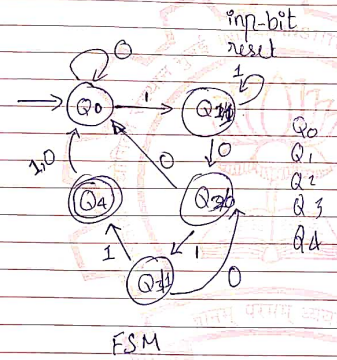
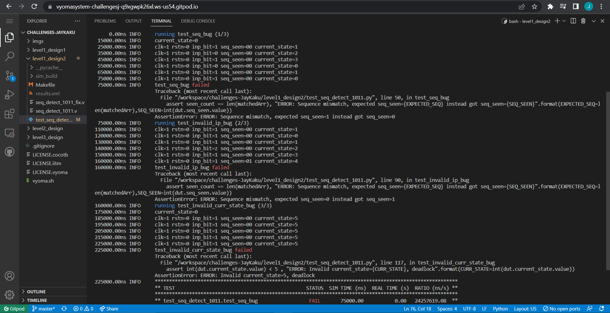
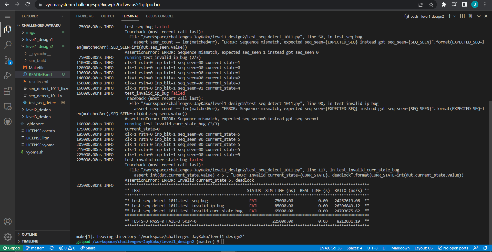
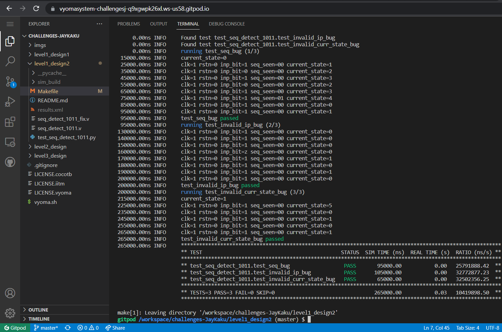

# 1011 Sequence Detector Design with Overlap Verification

The verification environment is setup using [Vyoma's UpTickPro](https://vyomasystems.com) provided for the hackathon.


## Design Description



## Verification Environment

The [CoCoTb](https://www.cocotb.org/) based Python test is developed as explained. 


Input sequence is stored in an array, the input pattern is matched by the test and compared to the output seen from the design.
 
 Code:
 ```
inp = [1,0,1,0,1,1,1,1]
    
    dut._log.info(f'current_state={int(dut.current_state.value)}')

    string=""
    seen_count = 0

    for i in inp:
        string+= str(i)
        dut.inp_bit.value = i

        await Timer(10, units='us')

        matchedArr = re.findall("1011",string)
        
        if(int(dut.seq_seen.value)==1):
            seen_count+=1
```

The `assert` statement compares the seq_seen count with the input pattern count in that order and determines the test status.

```
assert seen_count == len(matchedArr), "ERROR: Sequence mismatch, expected seq_seen={EXPECTED_SEQ} instead got seq_seen={SEQ_SEEN}".format(EXPECTED_SEQ=len(matchedArr),SEQ_SEEN=int(dut.seq_seen.value))
```


## Captured Bugs (3 Bugs)







## Test Scenario

## Test 1
- Test Inputs: inp_bit = [1,0,1,0,1,<1>,1,1], reset = 0                       
- Expected Output: seq_seen = 1 (at <1>)
- Observed Output in the DUT dut.seq_seen=0

## Test 2

- Test Inputs: inp_bit = [1,1,1,z,1,1,1,1], reset = 0 
- Expected Output: seq_seen = 0
- Observed Output in the DUT dut.seq_seen=1

## Test 3

- Test Inputs: next_state = 5
- Expected Output: current_state = 0
- Observed Output in the DUT dut.current_state.value = 5

## Design Bug
Based on the above test input and analysing the design, we see the following

```
  // state transition based on the input and current state
  always @(inp_bit or current_state)
  begin
    case(current_state)
      IDLE:
      begin
        if(inp_bit == 1)
          next_state = SEQ_1; // 1
        else
          next_state = IDLE; // 0
      end
      SEQ_1:
      begin
        if(inp_bit == 1) // <==== Bug: edge case if inp= x or z invalid state change would happen, instead of 1 we need 0
          next_state = IDLE; // 11
        else
          next_state = SEQ_10; //10
      end
      SEQ_10:
      begin
        if(inp_bit == 1)
          next_state = SEQ_101; // 101
        else
          next_state = IDLE; // 100
      end
      SEQ_101:
      begin
        if(inp_bit == 1)
          next_state = SEQ_1011; //1011
        else
          next_state = IDLE; //1010  <==== Bug, next_state shd be SEQ_10, modification need need to use elif here to handle for x & z
      end
      SEQ_1011:
      begin
        next_state = IDLE; // 1011 detected back to idle
      end
      //<=== BUG: missing default case which helps design recover from invalid states ===>
    endcase
  end
endmodule
```

## Design Fix
Updating the design and re-running the test makes the test pass.

### Updated design

```
 // state transition based on the input and current state
  always @(inp_bit or current_state)
  begin
    case(current_state)
      IDLE:
      begin
        if(inp_bit == 1)
          next_state = SEQ_1; // 1
        else
          next_state = IDLE; // 0 or x or z
      end
      SEQ_1:
      begin
        if(inp_bit == 0)               <==== Fix
          next_state = SEQ_10; //10
        else
          next_state = IDLE; // 11 or 1x or 1z
      end
      SEQ_10:
      begin
        if(inp_bit == 1)
          next_state = SEQ_101; // 101
        else
          next_state = IDLE; // 100
      end
      SEQ_101:
      begin
        if(inp_bit == 1)                <==== Fix
          next_state = SEQ_1011; //1011
        else if (inp_bit == 0)          <==== Fix
          next_state = SEQ_10; //1010  
        else
          next_state = IDLE; //101x or 101z
      end
      SEQ_1011:
      begin
        next_state = IDLE; // 1011 detected back to idle
      end
      default: next_state = IDLE;       <=== Fixed
    endcase
  end
endmodule
```
## Passed Test (All image.png3)



## Verification Strategy

Test1: The design is given valid inputs to make sure the state transition in the FSM is valid and gives correct output (`seq_seen`) when a 1011 sequence is given in the input 

Test2: The design receives an input not specified in the an input not specified in the specification (1z11 or 1x11). To check the edge cases which might otherwise lead to states that are valid but not according to the FSM.

Test3: The design is put into an invalid state to see how it recoves from it and processes the string.

## Is the verification complete ?

The verification is complete as the valid as well as invalid inputs have been tested along with valid and invalid states as well as recovery.