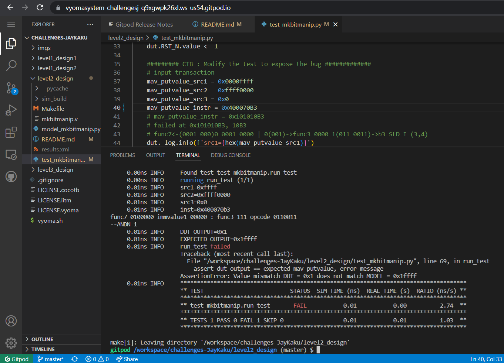

# 1011 Sequence Detector Design with Overlap Verification

The verification environment is setup using [Vyoma's UpTickPro](https://vyomasystems.com) provided for the hackathon.

## Verification Environment

The [CoCoTb](https://www.cocotb.org/) based Python test is developed as explained. 

## Captured Bugs (1 Bug)

## Test Scenario

## Test 1
- Test Inputs: 
    - mav_putvalue_src1 = 0x0000ffff
    - mav_putvalue_src2 = 0xffff0000
    - mav_putvalue_src3 = 0x0
    - mav_putvalue_instr = 0x400070B3                   
- Expected Output: 0x1ffff
- Observed Output in the DUT 0x1

## Verification Strategy

The design is given strategically to find error from alternate input sequence.

## Is the verification complete ?

The verification isn't complete.